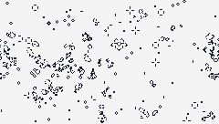

# Conway's Game of Life

An implementation of Conway's Game of Life in Lua for the [TIC-80 fantasy console](https://github.com/nesbox/TIC-80).

Rules, from Wikipedia:

1. Any live cell with two or three live neighbours survives.
2. Any dead cell with three live neighbours becomes a live cell.
3. All other live cells die in the next generation. Similarly, all other dead cells stay dead.

[Play it on the TIC-80 website.](https://tic80.com/play?cart=3605)



## Code

You can download the `.tic` file and load it up in TIC-80 to view the code/edit the game.

Please excuse the code indentation/formatting; it looks better in the TIC-80 editor.

```lua
-- title:  Conway's Game of Life
-- author: Aleksandr Hovhannisyan
-- desc:   Implementation of Conway's Game of Life in Lua
-- script: lua

function BOOT()
	-- The TIC() function runs at 60 FPS
	TIC_FPS=60
	-- Change this to run the game slower
	DESIRED_FPS=60
	-- Frame/generation counter, increments at TIC_FPS
	generation=0
	-- Likelihood of a cell spawning alive in gen 0
	ALIVE_SPAWN_CHANCE=0.1
 -- Screen dimensions (engine constants)
	Screen={
		WIDTH	=240,
		HEIGHT	=136,
	}
	-- Color palette
	Color={
		BLACK=0,
		WHITE=12,
	}
	-- Possible cell states
	CellState={
		DEAD	=false,
		ALIVE	=true,
	}
	-- Map cell states to colors
	CellColor={
		[CellState.ALIVE] =Color.BLACK,
		[CellState.DEAD]  =Color.WHITE,
	}
	-- Track cell state for every pixel
	-- in a 1D array (which we'll interpret
	-- as a 2D screen when drawing).
	oldCells={}
	for index=0,Screen.WIDTH*Screen.HEIGHT do
		diceRoll=math.random()
		state=CellState.DEAD
		if diceRoll<=ALIVE_SPAWN_CHANCE then
			state=CellState.ALIVE
		end
		oldCells[index]=state
	end
	-- Track old and new generation in
	-- separate tables upfront to avoid
	-- creating a new table each frame
	newCells={}
	CopyTable(oldCells,newCells)
end

-- Only works if values are primitive,
-- but they are in our case. If each cell
-- was itself a table, we'd need to modify this
function CopyTable(source,target)
	for k,v in pairs(source) do
		target[k]=v
	end
end

-- Returns the number of alive neighbor cells for the cell at the given index
function GetNumAliveNeighbors(cells,index)
	local numAliveNeighbors=0
	-- row 0:  		 0			1 		2 		3 ... 238 239
	-- row 1: 		240 241 242 243 ... 478 479
	neighbors={
		-- No need to check that these indices are in bounds since
		-- tables in Lua can have any index, so if the index is out of
		-- bounds, then the value we'll look at will just be nil
		left		=index-1,
		right		=index+1,
		top			=index-Screen.WIDTH,
		topLeft		=index-Screen.WIDTH-1,
		topRight	=index-Screen.WIDTH+1,
		bottom		=index+Screen.WIDTH,
		bottomLeft	=index+Screen.WIDTH-1,
		bottomRight	=index+Screen.WIDTH+1,
	}
	for direction,neighborIndex in pairs(neighbors) do
		if cells[neighborIndex]==CellState.ALIVE then
			numAliveNeighbors=numAliveNeighbors+1
		end
	end
	return numAliveNeighbors
end

-- This gives us the next generation of cells
function UpdateCells()
	for index,state in pairs(oldCells) do
		numAliveNeighbors=GetNumAliveNeighbors(oldCells,index)
		local newState=state
		-- Currently alive
		if state==CellState.ALIVE then
			if numAliveNeighbors<2 or numAliveNeighbors>3 then
				newState=CellState.DEAD
			end
		-- Currently dead
		else
			if numAliveNeighbors==3 then
				newState=CellState.ALIVE
			end
		end
		newCells[index]=newState
	end
	-- This "new" generation will be the next
	-- generation's old generation, so copy it now
	CopyTable(newCells,oldCells)
end

function DrawCells()
	for index,state in pairs(newCells) do
		poke(0x00000+index,CellColor[state],4)
	end
end

function TIC()
	if generation%(TIC_FPS/DESIRED_FPS)==0 then
		DrawCells()
		UpdateCells()
	end
	generation=generation+1
end
```
